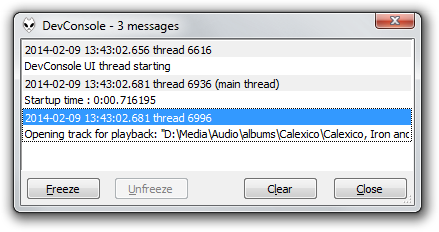

DevConsole for foobar20000
==========================

DevConsole is a console view plugin which was originally developed around 2005. Some plugins I can't remember existed at the time which would flood the foobar2000 console with messages. This inspired the creation and design of DevConsole.

Features
--------

* Decoupled from the main user interface: The DevConsole window is independent from the main window. It uses a separate thread to stay responsive even if the main window is blocked.
* Message flood resistent: The DevConsole window can handle a high rate of console messages.
* Suspend display update: The message list view can be frozen so new console message do not show up immediately.
* Message metadata: The message list view displays the time of day and the source thread of each console message.
* Background message collection: Console messages are recorded even when the DevConsole window is closed.

Screenshot
----------

Usage
-----

Open the *View* menu from the main menu bar and choose the *DevConsole* command to open the DevConsole window. The DevConsole window opens automatically when foobar2000 is started if it was open at the previous shutdown.

Click the *Close* button or press the escape key to close the DevConsole window.

Click the *Clear* button to remove all messages from the message list view and the message buffer.

Click the *Freeze* button to suspend updates to the message list view. Click the *Unfreeze* button to resume updates.

Press Ctrl+C or choose *Copy* from the context menu of the message list view to copy the selected entry to the clipboard.

Limitations
-----------

* The DevConsole window cannot be embedded into the main window. This is a consequence of its design.
* Long messages will be truncated horizontally and vertically.
* DevConsole does not support logging messages to disk.
* The font of the message list view cannot be configured.
* The message buffer is unbounded. The memory usage will grow indefinitely unless the message buffer is manually cleared.

Links
-----

- [foobar2000 homepage](http://www.foobar2000.org/)
